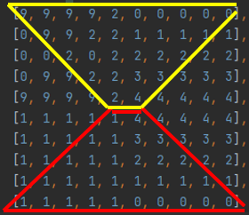

# Лабораторная работа №3  

---

## Задание для 23 Варианта  

С клавиатуры вводятся два числа **K** и **N**.  
Квадратная матрица **A(N, N)**, состоящая из 4-х равных по размерам подматриц (**B**, **C**, **D**, **E**), заполняется случайным образом целыми числами в интервале **[-10, 10]**.  
Для тестирования использовать **не случайное заполнение**, а целенаправленное.

### Формирование матрицы F:
1. **Проверка условия**:
    - В подматрице **E** вычисляется:
        - **Сумма чисел, больших K** в нечетных столбцах **области 3**.
        - **Произведение чисел по периметру в области 2**.  
    - Если **сумма** чисел больше, чем **произведение**, то:  
      **поменять в E симметрично области 1 и 2 местами**.  
    - Иначе:  
      **поменять C и B местами несимметрично**.  

2. **Операции над матрицами**:
    - После формирования **F** вычисляется выражение: (К*А)*F+K*F^T

3. Выводить по мере формирования:  
   - Матрицу **A**.  
   - Матрицу **F**.  
   - Все промежуточные и итоговые результаты.

---

## Условие:
### Главная диагональ учитывается при работе с областями!  
Пример: Области 1 (жёлтая) и 3 (красная) выделены на изображении ниже:  
  

---

## Тестирование  
Для тестирования используйте матрицу, созданную на **66-й строке кода**.

